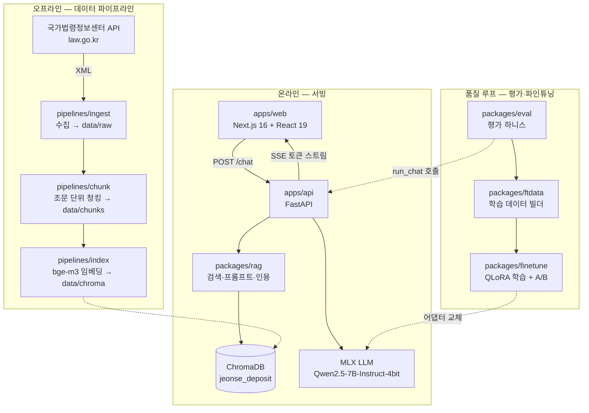
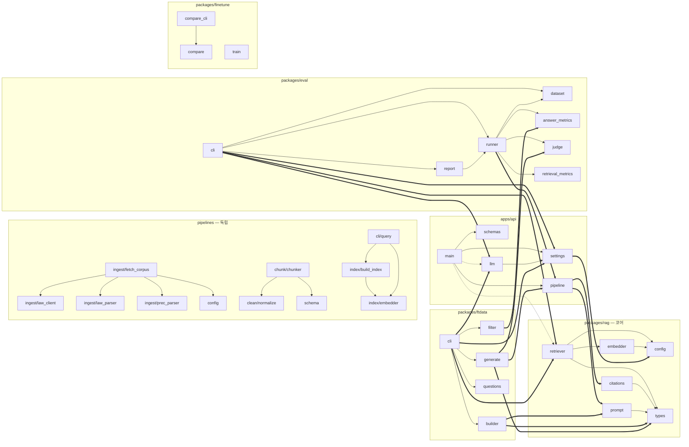
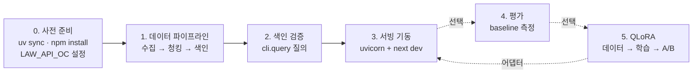
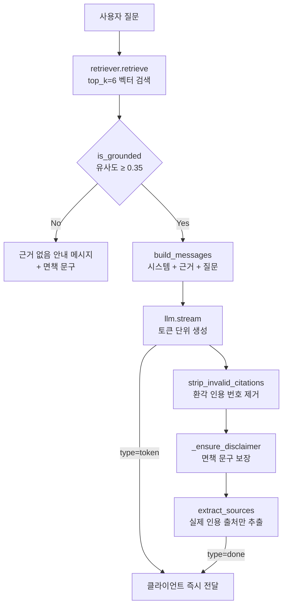

# PrivateLLM 아키텍처 다이어그램

주택임대차 보증금 반환 상담 RAG 챗봇의 구조를 다이어그램으로 정리한 문서입니다.

> **보는 방법** — VS Code에서 이 파일을 열고 `Ctrl+Shift+V`를 누르면 다이어그램이 그림으로 표시됩니다.
> VS Code 1.131부터 Mermaid 렌더링이 내장(`mermaid-markdown-features`)이라 별도 확장이 필요 없습니다.
> `bierner.markdown-mermaid` 확장은 내장 기능과 중복 렌더링을 일으켜 다이어그램이 빈 영역으로 표시되므로 설치하지 마세요.

> **갱신 대상 문서** — 구조가 바뀌면 이 문서를 함께 수정합니다.
> `docs/export/`의 기록은 시점별 스냅샷이므로 수정하지 않습니다.

---

## 1. 시스템 전체 구조

오프라인 파이프라인이 만든 `data/chroma`를 서빙 계층이 읽고, 품질 루프는 서빙과 **동일한 `run_chat` 경로**를 재사용해 평가·학습 데이터를 만듭니다.

관련 파일 — [pipelines/](../pipelines/) · [apps/api/src/api/main.py](../apps/api/src/api/main.py) · [apps/web/](../apps/web/) · [packages/rag/](../packages/rag/)

---

## 2. 모듈 의존 그래프

Python 소스의 `import` 문을 전수 추출해 그린 파일 단위 의존 관계입니다.

**화살표 범례**

| 표기 | 의미 |
|---|---|
| `──▶` | 패키지 내부 의존 |
| `══▶` | 패키지 경계를 넘는 의존 |
| `┈┈▶` | 함수 내부의 지연 import — [main.py:153](../apps/api/src/api/main.py#L153), [main.py:168](../apps/api/src/api/main.py#L168) |

**관찰**

1. 의존 방향이 `rag ← api ← eval ← ftdata` 단방향으로 정리되어 순환 의존이 없습니다.
2. `api.pipeline`의 `run_chat`이 허브입니다 — 서빙·평가·학습 데이터 생성 세 곳이 공유합니다.
3. 각 패키지의 `cli`/`main`이 조립 지점입니다. 무거운 실물 객체(`MlxLLM`, `Retriever`) 생성은 여기에만 있고 내부 모듈은 주입받아 동작하므로, 테스트에서 Fake 주입이 가능합니다.
4. `pipelines`는 `rag`/`api`를 전혀 import하지 않고 산출물 파일로만 연결됩니다. 단 [pipelines/index/embedder.py](../pipelines/src/pipelines/index/embedder.py)와 [rag/embedder.py](../packages/rag/src/rag/embedder.py)는 코드 공유 없이 같은 모델을 각자 로드하는 중복 구현이므로, 색인·검색 설정 일치가 규약으로만 보장됩니다.
5. `finetune`은 pyproject에 `api`/`eval` 의존을 선언했지만 소스 레벨 import는 없습니다.

---

## 3. 구축 실행 절차

0~3단계가 챗봇 기동을 위한 필수 경로, 4~5단계는 품질 개선을 위한 선택 경로입니다.

**단계별 명령**

| 단계 | 명령 | 산출물 |
|---|---|---|
| 0 | `uv sync` / `npm install` / `pipelines/.env`에 `LAW_API_OC` | — |
| 1 | `uv run python -m pipelines.ingest.fetch_corpus` `uv run python -m pipelines.chunk.chunker` `uv run python -m pipelines.index.build_index` | `data/raw` → `data/chunks` → `data/chroma` |
| 2 | `uv run python -m pipelines.cli.query "보증금을 못 받았어요"` | 유사도 확인 |
| 3 | `uv run uvicorn --app-dir src api.main:app --reload --port 8000` `npm run dev` | :8000 / :3000 |
| 4 | `uv run --package eval python -m eval.cli` | `data/eval_runs/baseline.json` |
| 5 | `uv run --package ftdata python -m ftdata.cli` `python -m mlx_lm.lora --train ...` `uv run --package finetune python -m finetune.compare_cli` | `data/ft/` → `data/adapters/qlora` → A/B 리포트 |

3단계 이후는 `mlx-lm`이 Apple Silicon 전용이므로 Windows 환경에서는 실행되지 않습니다. 자세한 내용은 [docs/superpowers/release/02-linux-gpu.md](superpowers/release/02-linux-gpu.md)의 `OpenAICompatLLM` 설계를 참고하세요.

---

## 4. 요청 처리 흐름 — `POST /chat`

환각 방어가 3중으로 걸려 있습니다 — ① grounding 임계값 판정, ② 잘못된 인용 번호 제거, ③ 법적 면책 문구 강제 삽입.

관련 파일 — [apps/api/src/api/pipeline.py](../apps/api/src/api/pipeline.py) · [packages/rag/src/rag/retriever.py](../packages/rag/src/rag/retriever.py) · [packages/rag/src/rag/citations.py](../packages/rag/src/rag/citations.py)
