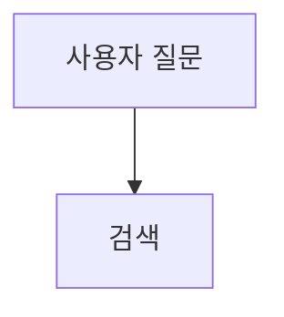
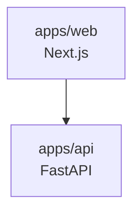
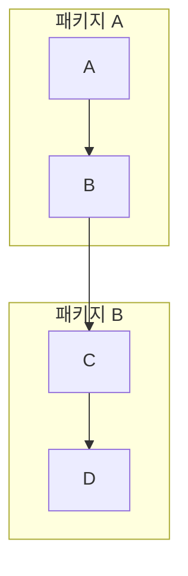
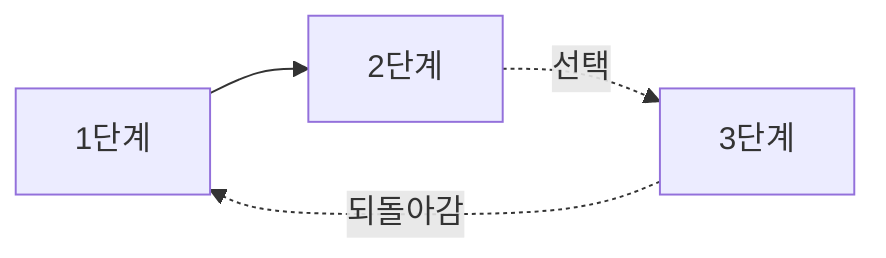
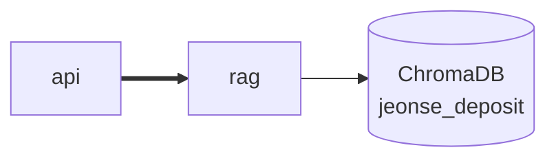
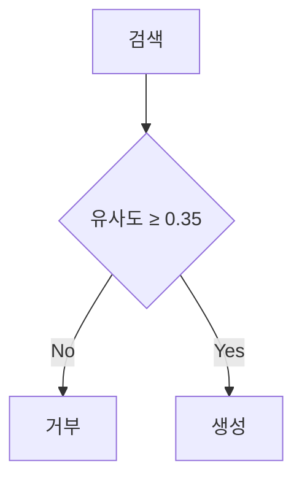

# mermaid 렌더링 진단 파일

각 케이스가 **그림으로 보이는지 / 빈 영역인지 / 에러 박스인지** 확인해 주세요.
이 파일은 진단 후 삭제합니다.

---

## 케이스 1 — 최소 다이어그램 (영문, 장식 없음)

---

## 케이스 2 — 한글 라벨

---

## 케이스 3 — ` ` 줄바꿈

---

## 케이스 4 — subgraph

---

## 케이스 5 — 점선 화살표 + 라벨 (§3에서 사용)

---

## 케이스 6 — 굵은 화살표 + 실린더 노드 (§1, §2에서 사용)

---

## 케이스 7 — 마름모 분기 + 특수문자 ≥ (§4에서 사용)

