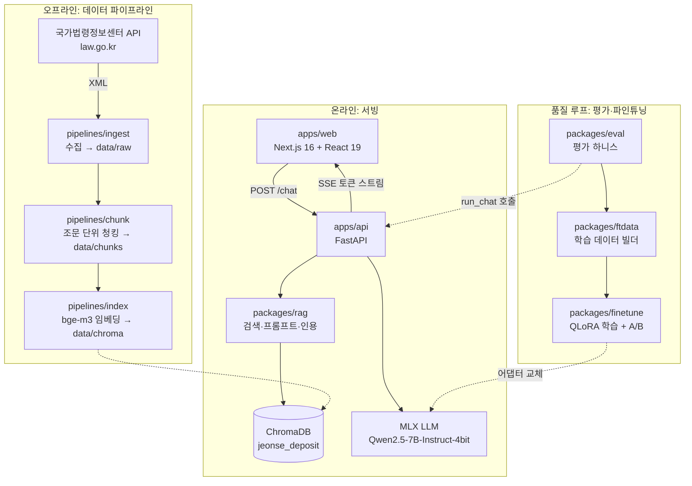

# PrivateLLM 아키텍처 분석

## 한 줄 요약

**"주택임대차 보증금 반환" 전문 법률 상담 RAG 챗봇**입니다. 국가법령정보센터(law.go.kr) API에서 법령·판례를 수집해 벡터 DB를 구축하고, 로컬 LLM(MLX + Qwen2.5-7B-4bit)으로 근거 기반 답변을 스트리밍하는 **완전 로컬(Private) LLM 시스템**이며, 평가·파인튜닝 파이프라인까지 갖춘 풀스택 모노레포입니다.

## 전체 구조 — uv 워크스페이스 모노레포

[pyproject.toml](pyproject.toml)이 루트에서 uv workspace로 6개 Python 하위 프로젝트를 묶고, `apps/web`(Next.js)만 제외합니다.



## 구성 요소별 역할

### 1. [pipelines/](pipelines/) — 데이터 수집·색인 (오프라인 배치)

| 단계 | 모듈 | 역할 |
|---|---|---|
| 수집 | [fetch_corpus.py](pipelines/src/pipelines/ingest/fetch_corpus.py) | law.go.kr API로 "주택임대차보호법", "민법" 등 법령과 "보증금 반환" 관련 판례 XML 수집 → `data/raw/{law,prec}/*.json` |
| 정제 | [normalize.py](pipelines/src/pipelines/clean/normalize.py) | 텍스트 정규화 |
| 청킹 | [chunker.py](pipelines/src/pipelines/chunk/chunker.py) | **구조 인지 청킹** — 법령은 조문 단위, 메타데이터(법령명·조문번호·URL·시행일) 보존 → `data/chunks/*.jsonl` |
| 색인 | [build_index.py](pipelines/src/pipelines/index/build_index.py) | BAAI/bge-m3 임베딩을 직접 계산해 ChromaDB `jeonse_deposit` 컬렉션에 upsert |

공통 스키마는 [schema.py](pipelines/src/pipelines/schema.py)의 `Chunk`(TypedDict)이며, 출처 유형은 `법령·판례·해설·상담사례` 4종으로 제한됩니다.

### 2. [packages/rag/](packages/rag/) — RAG 코어 (공유 라이브러리)

- [retriever.py](packages/rag/src/rag/retriever.py) — ChromaDB 코사인 유사도 검색(top_k=6) + **grounding 판정**(최고 유사도 < 0.35면 답변 거부)
- [embedder.py](packages/rag/src/rag/embedder.py) — 질문 → bge-m3 1024차원 벡터 (색인 시와 동일 모델 필수)
- [prompt.py](packages/rag/src/rag/prompt.py) — 검색 결과 + 질문 → OpenAI 호환 메시지 조립
- [citations.py](packages/rag/src/rag/citations.py) — 환각 인용 번호 제거(`strip_invalid_citations`) + 실제 인용된 출처만 추출(`extract_sources`)

### 3. [apps/api/](apps/api/) — FastAPI 백엔드

- [main.py](apps/api/src/api/main.py) — 앱 팩토리 + DI 패턴(`create_app(retriever, llm)` — 테스트 시 Fake 주입), Retriever/LLM은 **지연 로딩 싱글턴**
- [pipeline.py](apps/api/src/api/pipeline.py) — 핵심 오케스트레이션: **검색 → grounding 체크 → 프롬프트 → LLM 스트리밍 → 인용 정리 + 면책 문구 강제**
- [llm.py](apps/api/src/api/llm.py) — MLX 기반 로컬 추론 (Apple Silicon 전용)
- SSE 프로토콜: `{"type":"token"}` 반복 → `{"type":"done","answer","sources"}` 1회

### 4. [apps/web/](apps/web/) — Next.js 16 프론트엔드

- React 19 + Tailwind 4 + **Zustand**(UI 상태) + **TanStack Query**(서버 상태)
- [lib/sse.ts](apps/web/lib/sse.ts) → [lib/chatClient.ts](apps/web/lib/chatClient.ts) → [hooks/useChat.ts](apps/web/hooks/useChat.ts) → [components/Chat.tsx](apps/web/components/Chat.tsx) 계층 구조
- 컴포넌트: 채팅창, 입력창, 말풍선, **SourceCard**(출처 인용 표시) — 전부 Vitest 테스트 동반

### 5. 품질 루프 — [eval](packages/eval/) → [ftdata](packages/ftdata/) → [finetune](packages/finetune/)

- **eval**: 평가셋(`eval_set.jsonl`)으로 검색 hit율, 답변 형식 지표, **LLM-as-Judge** 근거성 점수 측정
- **ftdata**: 품질 필터를 통과한 답변을 **서빙과 동일한 프롬프트 형식**의 MLX chat JSONL로 변환, train/valid 분할
- **finetune**: `mlx_lm.lora` 명령 빌더로 **QLoRA** 학습 + 학습 전/후 A/B 비교

## 의존성 그래프 (workspace 내부)

```
pipelines (독립)          rag (코어, 의존 없음)
                           ↑
                          api ← eval ← ftdata
                           ↑     ↑       
                        finetune ┘
```

`rag`가 최하층 코어이고, `api`가 이를 소비하며, 평가→데이터→학습 순으로 상위 패키지가 하위를 재사용합니다. `pipelines`는 산출물(`data/chroma`)로만 연결되는 완전 독립 배치입니다.

## 아키텍처 특징

1. **완전 로컬 실행** — 외부 LLM API 없이 MLX + 4bit 양자화 모델로 온디바이스 추론 (프로젝트명 "PrivateLLM"의 의미). 단, MLX는 Apple Silicon 전용이라 현재 Windows 환경에서는 API 서버 실제 추론은 불가하고 테스트(FakeLLM 주입)만 가능합니다.
2. **환각 방어 3중 장치** — ① grounding 판정(유사도 임계값), ② 잘못된 인용 번호 제거, ③ 법적 면책 문구 강제 삽입 — 법률 도메인 특성을 반영한 설계입니다.
3. **테스트 우선 설계** — 모든 패키지에 테스트 디렉터리, DI로 Fake 주입, `slow` 마커로 모델/네트워크 테스트 분리, XML fixture 기반 파서 테스트.
4. **학습용 저장소 성격** — 전 코드에 한국어 교육용 주석이 상세히 달려 있고, `python/edu`에 별도 학습 자료, `docs/export`에 학습 기록이 축적되어 있습니다.
5. **서빙-학습 일관성** — 파인튜닝 데이터를 서빙과 동일한 `build_messages()`로 생성해 train/serve skew를 방지합니다.
