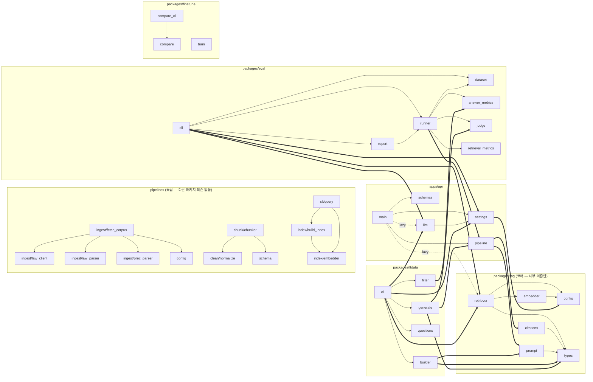

모듈(파일) 단위 import 관계를 전수 추출했습니다. 함수 안의 지연 import([main.py:153](apps/api/src/api/main.py#L153), [main.py:168](apps/api/src/api/main.py#L168))까지 포함한 결과입니다.

## 전체 모듈 의존 그래프

- 굵은 화살표(`==>`)는 **패키지 경계를 넘는 의존**, 점선(`-.lazy.-`)은 함수 내부의 **지연 import**입니다.

## 패키지별 상세

### pipelines — 완전 독립 (rag/api를 전혀 import하지 않음)

| 모듈 | 의존 대상 | 비고 |
|---|---|---|
| [ingest/fetch_corpus.py](pipelines/src/pipelines/ingest/fetch_corpus.py) | `config`, `ingest/law_client`, `ingest/law_parser`, `ingest/prec_parser` | 외부: `lxml`, `requests` |
| [chunk/chunker.py](pipelines/src/pipelines/chunk/chunker.py) | `clean/normalize`, `schema` | |
| [index/build_index.py](pipelines/src/pipelines/index/build_index.py) | `index/embedder` | 외부: `chromadb` |
| [cli/query.py](pipelines/src/pipelines/cli/query.py) | `index/build_index`(COLLECTION 상수), `index/embedder` | 외부: `chromadb` |

pipelines는 산출물 파일(`data/chunks`, `data/chroma`)로만 서빙 측과 연결됩니다. 단, [index/embedder.py](pipelines/src/pipelines/index/embedder.py)와 [rag/embedder.py](packages/rag/src/rag/embedder.py)는 **코드 공유 없이 동일 모델(bge-m3)을 각자 로드**하는 중복 구현입니다 — 색인/검색 설정 일치가 규약으로만 보장됩니다.

### packages/rag — 최하층 코어

- `types`가 최하단(의존 없음) → `config` → `embedder` → `retriever` 순의 깔끔한 계층
- `prompt`, `citations`는 `types`에만 의존하는 순수 함수 모듈

### apps/api — rag의 유일한 직접 소비자(서빙 경로)

- `pipeline` → `rag.citations`, `rag.prompt` (정적 import)
- `settings` → `rag.config`
- `main` → `rag.retriever`, `llm`은 **지연 import** (모델 로딩 비용 때문에 첫 요청 시 생성)
- `llm` → `settings`(MLX_MODEL 상수) — `schemas`는 의존 없음(pydantic만)

### packages/eval — api + rag 소비

- `runner` → `api.pipeline`(run_chat 재사용이 핵심), 내부 지표 모듈 4개
- `cli`가 조립 지점: 실제 `api.llm.MlxLLM` + `rag.retriever.Retriever` 생성 후 runner에 주입

### packages/ftdata — 3개 패키지(rag, api, eval) 모두 소비 (의존이 가장 넓은 패키지)

- `generate` → `api.pipeline` + `eval.judge` (답변 생성 후 즉시 근거성 채점)
- `filter` → `eval.answer_metrics` (평가 지표를 학습 데이터 품질 필터로 재사용)
- `builder` → `rag.prompt` (**서빙과 동일한 프롬프트로 학습 예제 생성** — train/serve 일관성의 근거)

### packages/finetune — 내부 의존 거의 없음

- `train`은 `mlx_lm.lora` CLI 명령을 조립만 하는 독립 모듈, `compare_cli` → `compare` 하나뿐
- pyproject에는 api/eval 의존이 선언돼 있지만 **소스 코드 레벨에서는 실제 import 없음** (테스트/실행 편의용 선언)

## 관찰 요약

1. **의존 방향이 단방향으로 정리됨**: `rag ← api ← eval ← ftdata` 순으로 상위가 하위를 소비하며 역방향·순환 의존이 없습니다.
2. **`api.pipeline`(run_chat)이 허브**: 서빙(main), 평가(eval.runner), 학습 데이터 생성(ftdata.generate) 세 곳이 같은 함수를 공유 — 품질 루프 전체가 실제 서빙 경로 그대로 동작합니다.
3. **각 패키지의 `cli`가 조립 지점(composition root)**: 무거운 실물 객체(MlxLLM, Retriever) 생성은 cli/main에만 있고, 내부 모듈은 주입받아 동작 — 테스트 시 Fake 주입이 가능한 구조입니다.
