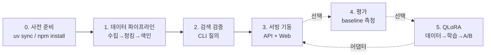

# LLM 시스템 구축 실행 절차

전체 절차는 **5단계**입니다. ①~③이 챗봇을 띄우기 위한 **필수 경로**, ④~⑤는 품질 개선을 위한 **선택 경로**입니다.



---

## ⓪ 사전 준비 (최초 1회)

```bash
# 저장소 루트에서 — 워크스페이스 전체 Python 의존성 설치
uv sync

# 웹 의존성
cd apps/web && npm install && cd ../..

# 국가법령정보센터 API 키 설정
cp pipelines/.env.example pipelines/.env
# → .env 안에 LAW_API_OC=발급받은_이메일ID 입력
```

`LAW_API_OC`는 [config.py:67-70](pipelines/src/pipelines/config.py#L67-L70)에서 **없으면 즉시 RuntimeError**로 중단시키는 필수값입니다. law.go.kr 오픈API 신청 후 받은 OC(이메일 ID)를 넣습니다.

---

## ① 데이터 파이프라인 — 지식 베이스 구축

`pipelines`를 순서대로 3번 실행합니다. 각 단계가 `data/` 아래에 산출물을 남기고, 다음 단계가 그것을 읽습니다.

```bash
cd pipelines

# 환경변수 로드 (bash/zsh)
set -a; source .env; set +a
#  ↳ PowerShell이면: $env:LAW_API_OC = "발급받은ID"

# 1) 수집 — law.go.kr에서 법령·판례 XML 수집 → data/raw/{law,prec}/*.json
uv run python -m pipelines.ingest.fetch_corpus

# 2) 청킹 — 조문 단위로 분할 + 정규화 → data/chunks/*.jsonl
uv run python -m pipelines.chunk.chunker

# 3) 색인 — bge-m3 임베딩 계산 후 Chroma에 upsert → data/chroma/
uv run python -m pipelines.index.build_index
```

| 단계 | 수집 대상 | 산출물 |
|---|---|---|
| 수집 | 법령: `주택임대차보호법`, `민법` / 판례: `임대차 보증금 반환`, `임차보증금 반환`, `보증금 반환 동시이행` ([fetch_corpus.py:26-28](pipelines/src/pipelines/ingest/fetch_corpus.py#L26)) | `data/raw/` |
| 청킹 | 법령 1조문 = 1청크, 메타데이터(법령명·조번호·URL·시행일) 보존 | `data/chunks/` |
| 색인 | `jeonse_deposit` 컬렉션, 64개씩 배치 임베딩 | `data/chroma/` |

**주의 — 색인/검색 설정 일치**: [pipelines/index/embedder.py](pipelines/src/pipelines/index/embedder.py)와 [rag/embedder.py](packages/rag/src/rag/embedder.py)는 별개 구현이므로, 임베딩 모델(`BAAI/bge-m3`)과 컬렉션명(`jeonse_deposit`)이 양쪽에서 동일해야 합니다. 다르면 벡터 공간이 어긋나 검색이 무의미해집니다.

**첫 실행은 오래 걸립니다** — bge-m3 모델(약 2GB)을 HuggingFace에서 내려받습니다.

---

## ② 색인 검증 (서빙 전 확인)

API를 띄우기 전에 검색이 제대로 되는지 CLI로 확인합니다.

```bash
cd pipelines
uv run python -m pipelines.cli.query "보증금을 못 받았어요"
```

관련 조문이 유사도와 함께 나오면 정상입니다. 여기서 결과가 비거나 유사도가 0.35 미만이면, 서빙해도 [retriever.py:161](packages/rag/src/rag/retriever.py#L161)의 grounding 판정에 걸려 **"근거를 찾지 못했습니다"만 반환**되므로 반드시 이 단계를 통과시켜야 합니다.

---

## ③ 서빙 기동 — 터미널 2개

**터미널 1 — API 서버 (포트 8000)**
```bash
cd apps/api
uv run uvicorn --app-dir src api.main:app --reload --port 8000     # 개발
# 운영: uv run uvicorn --app-dir src api.main:app --host 0.0.0.0 --port 8000
```

**터미널 2 — 웹 (포트 3000)**
```bash
cd apps/web
cp .env.local.example .env.local      # NEXT_PUBLIC_API_BASE=http://localhost:8000
npm run dev                            # 개발
# 운영: npm run build && npm run start
```

→ http://localhost:3000 접속

**동작 확인**
```bash
curl http://localhost:8000/health          # {"status":"ok"}
curl -N -X POST http://localhost:8000/chat \
  -H "Content-Type: application/json" \
  -d '{"message":"계약이 끝났는데 보증금을 안 돌려줍니다"}'
```

첫 `/chat` 요청 시 MLX 7B 모델과 Chroma 리트리버를 **지연 로딩**하므로([main.py:147-172](apps/api/src/api/main.py#L147-L172)) 첫 응답만 수십 초 걸립니다. 이후 요청은 캐시된 싱글턴을 재사용합니다.

> ⚠️ **운영 시 `--workers` 다중화 금지** — 워커마다 7B 모델을 각각 메모리에 올려 수십 GB를 소모합니다. 단일 워커를 유지하세요.

---

## ④ 평가 — baseline 품질 측정 (선택)

```bash
uv run --package eval python -m eval.cli
# → data/eval_runs/baseline.json
```

[eval_set.jsonl](packages/eval/eval_set.jsonl)의 모든 질문을 실제 Retriever + MlxLLM으로 실행하고 검색 hit율·답변 형식 지표·LLM-as-Judge 근거성 점수를 집계합니다.

---

## ⑤ QLoRA 파인튜닝 + A/B (선택)

```bash
# 1) 학습 데이터 생성 — 질문 풀로 답변 생성 → 품질 필터 → train/valid 분할
uv run --package ftdata python -m ftdata.cli --k 6 --per-q 2 --min-ground 0.5
#    → data/ft/{train.jsonl, valid.jsonl, stats.json}

# 2) LoRA 학습 — build_lora_command()가 조립하는 명령
python -m mlx_lm.lora \
  --model mlx-community/Qwen2.5-7B-Instruct-4bit \
  --train --data ./data/ft --adapter-path ./data/adapters/qlora \
  --iters 300 --batch-size 1 --num-layers 8 --learning-rate 1e-5

# 3) 어댑터 적용 평가
uv run --package eval python -m eval.cli --label qlora --adapter ./data/adapters/qlora

# 4) A/B 비교 리포트
uv run --package finetune python -m finetune.compare_cli
```

`--min-ground 0.5` 미만 후보는 [filter.py](packages/ftdata/src/ftdata/filter.py)에서 탈락하며, 채택된 답변만 **서빙과 동일한 `build_messages()` 프롬프트**로 학습 예제가 됩니다. 평가 시 답변 생성 모델은 어댑터를 쓰지만 **judge 모델은 항상 기본 모델**을 사용해 채점 기준을 고정합니다.

---

## 환경변수 정리

| 변수 | 적용 대상 | 기본값 | 용도 |
|---|---|---|---|
| `LAW_API_OC` | pipelines | **필수(없으면 에러)** | law.go.kr API 인증 |
| `DATA_ROOT` | pipelines | `<repo>/data` | 산출물 위치 |
| `CHROMA_DIR` | api / rag | `<repo>/data/chroma` | 벡터 DB 위치 |
| `MLX_MODEL` | api | `mlx-community/Qwen2.5-7B-Instruct-4bit` | 모델 교체 |
| `NEXT_PUBLIC_API_BASE` | web | `http://localhost:8000` | API 주소 |

## 검증 명령

```bash
uv run pytest                # 빠른 테스트 (모델/네트워크 제외)
uv run pytest -m slow        # 실제 모델·네트워크 포함
cd apps/web && npm test      # Vitest
```

---

## 현재 환경(Windows) 관련 제약

②단계까지는 Windows에서 그대로 동작하지만, **③~⑤단계는 실행되지 않습니다**. `mlx-lm`은 Apple Silicon 전용이라 `api.llm.MlxLLM` 생성 시 실패하고, 이를 사용하는 eval/ftdata/finetune도 마찬가지입니다.

Windows에서 진행하려면 두 가지 선택지가 있습니다.

1. **테스트만 실행** — DI 구조상 FakeLLM 주입으로 파이프라인 로직 검증은 전부 가능합니다 (`uv run pytest`).
2. **LLM 백엔드 교체** — [docs/superpowers/release/02-linux-gpu.md](docs/superpowers/release/02-linux-gpu.md)에 설계된 `OpenAICompatLLM`(vLLM/Ollama 등 OpenAI 호환 엔드포인트)을 구현해 `MlxLLM`을 대체하면 동일 코드로 동작합니다. `LLM` Protocol이 이미 있어 백엔드 구현 1개만 추가하면 되고, 검색·프롬프트·인용·면책 경로는 그대로 유지됩니다.

필요하시면 `OpenAICompatLLM` 구현을 진행해 드리겠습니다.
